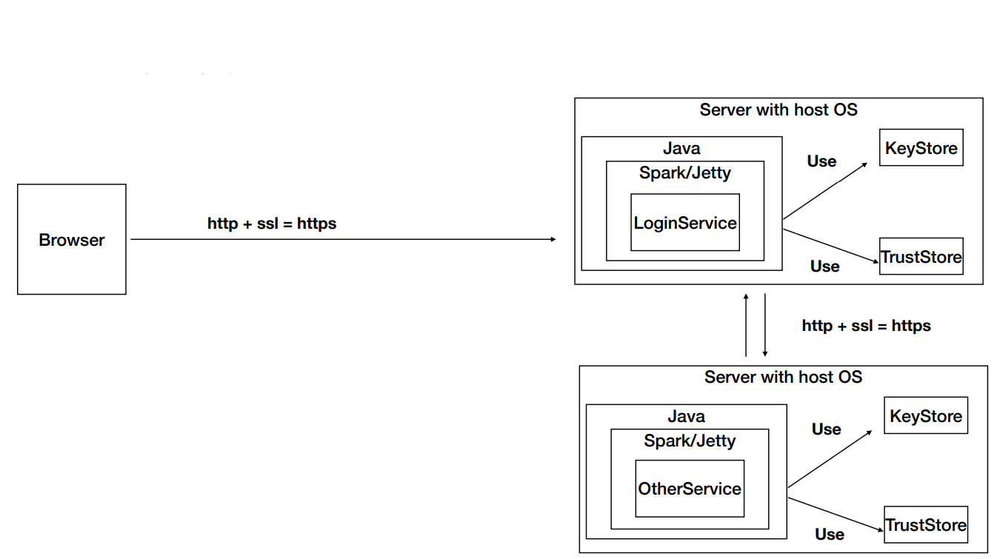

# AREP LABORATORIO 6 - APLICACIÓN DISTRIBUIDA SEGURA EN TODOS SUS FRENTES

Aplicativo Web diseñado en Java haciendo uso del framework Spark con el objetivo de realizar la implementación y uso de certificados SSL y el uso del protocolo HTTPS, con una arquitectura basada en 2 nodos que se comunicaran entre sí haciendo uso de estos certificados (SSL), uno de ellos encargado de prestar un servicio el cual en este caso es una calculadora encargada de retornar la media y la desviación estándar de un conjunto n de datos, y el segundo nodo encargado de enviar al primero la cadena de datos con la cual este va a trabajar y de brindar adicionalmente un soporte a usuarios, los cuales serán capaces de hacer login y hacer logout, este nodo además será el encargado de llevar un control sobre las sesiones de estos usuarios y de encriptar las contraseñas de los mismos.

### PREREQUISITOS

Los prerrequisitos que manejaremos para lograr con exito el desarrollo del laboratorio son:
- Maven
- Git
- Aws
- Docker
## DOCKER IMAGES

 vemos las imagenes en las siguientes webs:

- DemoSecurityLogin:
    https://hub.docker.com/repository/docker/memo1019/SecurityLogin
- DemoSecurityService:
    https://hub.docker.com/repository/docker/memo1019/SecurityService


### Ejecucion e instalacion
se debe clonar el proyecto con el siguiente comando:

```
git clone https://github.com/memo1019/LAB06-AREP
```
luego ingresaremos a la carpeta dede el cmd o la consola:
```
cd /Lab06-AREP
```
Finalmente coonstruiremos y compilaremos el proyecto para asi poder ejecutarlo.
```
 docker pull memo1019/SecurityService:latest
 docker pull memo1019/SecurityLogin:latest
```

**corre el proyecto con Docker**
  
```sh
  $ docker run -dp <localport>:8000 memo1019/SecurityService
  $ docker run -dp <localport>:8000 memo1019/SecurityLogin
```

**prueba tus apps**

```sh
  $ docker ps
  $ docker logs <dockerID/dockername>
```
## Pruebas

***Web-App corriendo localmente con la arquitectura descrita***


***instancia ejecutada***


***Grupo de seguridad***


***Web-App corriendo en AWS con la arquitectura descrita***


***imagenes del docker y contenedores de la instancia de EC2 corriendo con ssh***


## Diseño


### Diagrama de clases
#### Load Balancer


#### Rest Server

## Documentacion
para realizar la documentacion de javadoc use estos comandos y aqui podra llevar acabo el proceso de creacion de esta documentacion.
```
$ mvn javadoc:javadoc
$ mvn javadoc:jar
$ mvn javadoc:aggregate
$ mvn javadoc:aggregate-jar
$ mvn javadoc:test-javadoc
$ mvn javadoc:test-jar
$ mvn javadoc:test-aggregate
$ mvn javadoc:test-aggregate-jar
```
si desea ver el javadoc se encuentra en el directorio
```
/target/site
```

Podemos ver la descripcion del proyecto en este pdf [file](/lab6.pdf) mostrando el diseño y la estructura del proyecto

## Construido con

* [Maven](https://maven.apache.org/) - Dependency Management
* Git - Version Control    
* Apache Maven 3.6.3
* Docker
* Spark web
* Java 1.8.0_211
* Git 2.26.2
* AWS (EC2)
   ### Video del despliegue en AWS
   
   [](https://www.youtube.com/watch?v=Q9Yq7MxHnko)
   
   
  ## Comandos a Usar
  
  
  ***Listar todos los contenedores***
  
   ```sh
    $ docker container ls 
    $ docker ps -a (List all containers not just running)
   ```
     
    ***Listar imagenes***

      ```sh
    $ docker images  
     ```

   ***Contruir una imagen de un Dockerfile***

    ```sh
    $ docker build -t <myimage> 
  ```
   ***Correr un contenedor***

    ```sh
    $ docker run -d -p <localport>:<containerport> --name firstdockercontainer <image> 
  ```
   ***Correr docker-compose con 3 instancias web***

  ```sh
    $ docker-compose up -d --scale web=3
  ```

   ***Obtener un shell del contenedor***

  ```sh
    $ docker exec -it <docker ID> /bin/bash
  ```

## Autor

* **Guillermo Alfonso Castro Camelo** - [Memo1019](https://github.com/memo1019)

## Licencia

This project is licensed under the GNU v3.0 License - see the [LICENSE](LICENSE.txt) file for details
